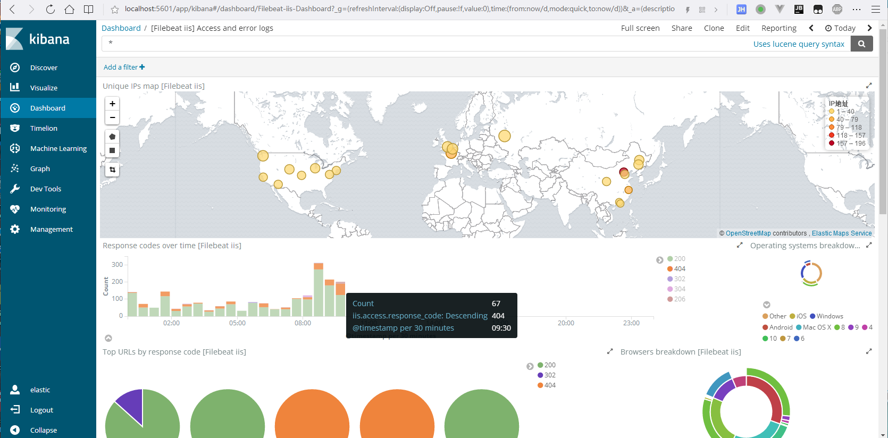

# fllebeat-6.0.0的iis模块 #
## 使用方法 ##
    filebeat setup -e

### 本模块的日志格式 ###
| date time | s-sitename | s-ip | cs-method | cs-uri-stem | cs-uri-query | s-port | cs-username | c-ip | cs(User-Agent) | cs(Referer) | sc-status | sc-win32-status | time-taken |
| - | :-: | :-: | :-: | :-: | :-: | :-: | :-: | :-: | :-: | :-: | :-: | :-: | -: |
| 2017-11-18 16:16:16 | W3SVC14 | 123.12.123.123 | GET | /robots.txt | - | 80 | - | 69.30.221.250 | Mozilla/5.0+(compatible;+MJ12bot/v1.4.7;+http://mj12bot.com/) | - | 200 | 0 | 453 |
